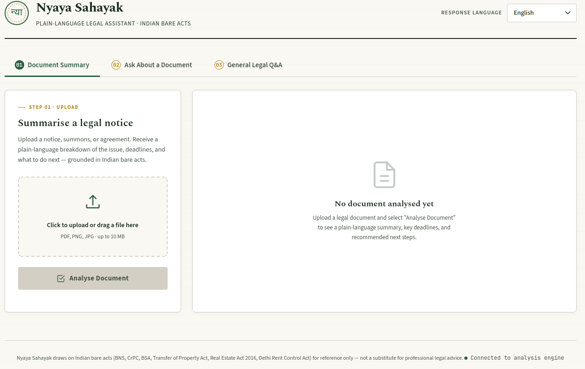
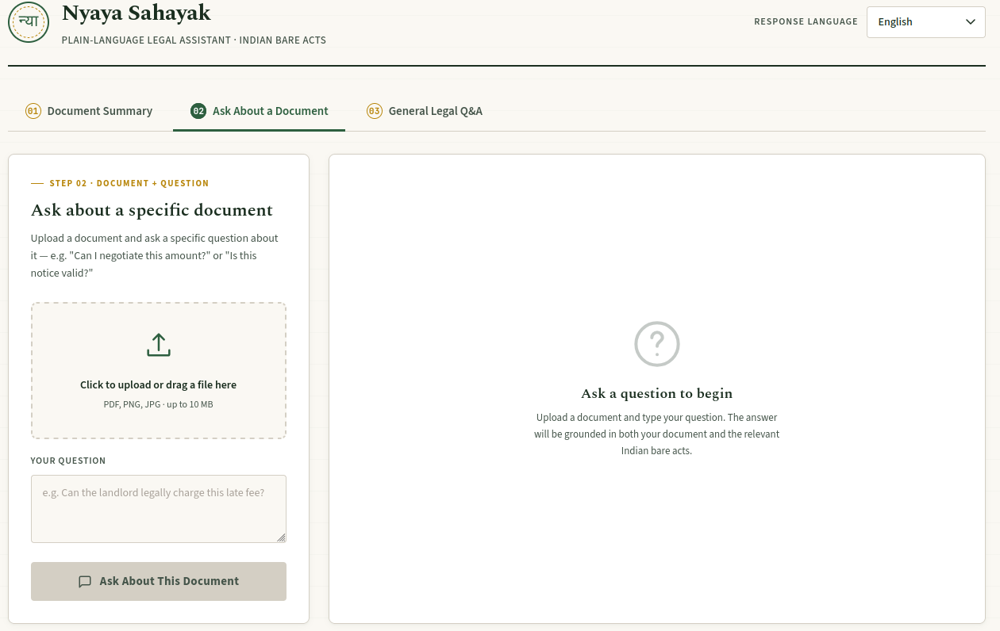
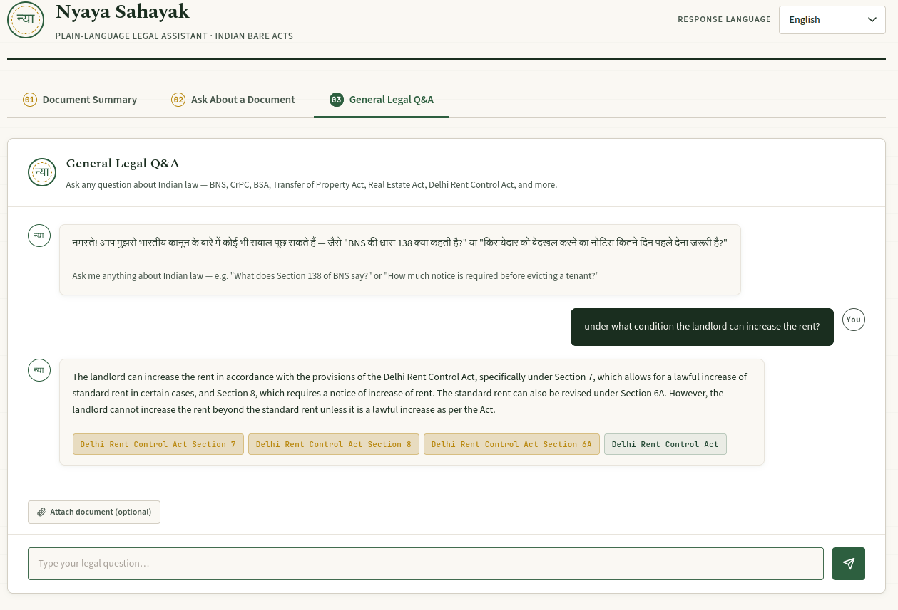

# Nyaya Sahayak — AI Legal Document Assistant

> **न्याय सहायक** (Justice Helper) — A free, local-first RAG pipeline that explains Indian legal documents in plain language, in your own regional language.

---

## Table of Contents

- [Problem Statement](#problem-statement)
- [Our Solution](#our-solution)
- [Architecture](#architecture)
- [Tech Stack](#tech-stack)
- [Project Structure](#project-structure)
- [Setup & Installation](#setup--installation)
- [Building the Knowledge Base](#building-the-knowledge-base)
- [Running the Application](#running-the-application)
- [How to Use](#how-to-use)
- [API Reference](#api-reference)
- [Supported Languages & File Types](#supported-languages--file-types)
- [Limitations & Disclaimers](#limitations--disclaimers)

---

## Problem Statement

Every year, millions of Indians receive legal documents they don't understand — eviction notices, cheque-bounce complaints, property disputes, rent agreements, FIR copies. These documents are:

- Written in **dense legal English**, full of jargon ("hereinafter", "notwithstanding", "without prejudice")
- Often **time-sensitive**, with deadlines buried in paragraph 4 of page 3
- Frequently received by people who are **more comfortable in a regional language** than English
- Too small a matter (or too urgent) to immediately afford a lawyer

The result: people miss deadlines, don't know their rights, and either panic or ignore notices that needed a response — sometimes with serious legal consequences.

**The gap:** there is no free, instant, trustworthy way for an ordinary citizen to upload a document and get a clear answer to *"What does this mean for me, and what do I do now?"* — grounded in actual Indian law, not generic AI guesswork.

---

## Our Solution

Nyaya Sahayak is a **Retrieval-Augmented Generation (RAG)** system that:

1. **Reads** any legal document — typed PDF, scanned PDF, or photo of a paper notice (via OCR)
2. **Retrieves** the exact relevant clauses from a local database of **six Indian bare acts**:
   - Bharatiya Nyaya Sanhita (BNS)
   - Code of Criminal Procedure (CrPC)
   - Bharatiya Sakshya Adhiniyam (BSA)
   - Transfer of Property Act
   - Real Estate (Regulation and Development) Act, 2016
   - Delhi Rent Control Act
3. **Explains** the document in plain language — what's happening, what deadlines apply, and exactly what to do next
4. **Answers follow-up questions** — either about the uploaded document, or general questions about Indian law
5. **Translates** everything into the user's preferred regional language (Hindi, Tamil, Telugu, Marathi, Bengali, Kannada, Gujarati, Punjabi, Odia, or English)
6. **Flags uncertainty** — every response includes a "hallucination warning" indicating whether the advice is fully grounded in the cited legal text, so users know when to consult a professional

The entire system runs on **free-tier infrastructure** — local embeddings, a local vector database, and Groq's free LLM API — making it a genuinely $0-cost deployment.

---

## Architecture

```
┌──────────────────────────────────────────────────────────────────────┐
│                              FRONTEND                                  │
│                          (index.html)                                  │
│                                                                          │
│   ┌─────────────┐   ┌─────────────────┐   ┌───────────────────────┐  │
│   │  Tab 1:      │   │  Tab 2:          │   │  Tab 3:                │  │
│   │  Document    │   │  Document +      │   │  General Legal         │  │
│   │  Summary     │   │  Question        │   │  Q&A Chat               │  │
│   └──────┬───────┘   └────────┬─────────┘   └───────────┬─────────────┘  │
└──────────┼────────────────────┼─────────────────────────┼───────────────┘
           │                    │                          │
           │   multipart/form-data (file, lang, question)  │
           ▼                    ▼                          ▼
┌──────────────────────────────────────────────────────────────────────┐
│                            api.py (FastAPI)                            │
│                                                                          │
│   GET  /                  → health check                                │
│   POST /api/v1/analyze    → file (+ optional question)                  │
│   POST /api/v1/ask        → question (+ optional file)                  │
│                                                                          │
│   • CORS enabled for all origins                                        │
│   • File validation (.pdf, .png, .jpg, .jpeg)                           │
│   • Request logging middleware                                          │
└───────────────────────────────┬──────────────────────────────────────┘
                                  │
                                  ▼
┌──────────────────────────────────────────────────────────────────────┐
│                          llm_chain.py                                   │
│                    (Orchestration Pipeline)                             │
│                                                                          │
│  Step 0:  Text Extraction                                               │
│           ├─ PDF (digital)  → PyMuPDF                                   │
│           ├─ PDF (scanned)  → rasterise pages → Tesseract OCR           │
│           └─ Image          → Tesseract OCR                             │
│                                                                          │
│  Step 1:  Keyword Extraction (Groq / Llama 3.3 70B)                     │
│           └─ Extracts 2-3 precise legal search terms                    │
│                                                                          │
│  Step 2:  Vector Search  ───────────────────────────┐                   │
│           └─ calls retrieve_legal_context()         │                   │
│                                                       ▼                   │
│  Step 3:  Contextual Synthesis                  ┌─────────────┐          │
│           └─ combines document + RAG chunks     │ rag_engine  │          │
│              into a structured prompt           │    .py      │          │
│                                                  └─────────────┘          │
│  Step 4:  Generation + Translation (Groq)                                │
│           └─ outputs structured JSON in target language                 │
│              + self-correcting JSON retry on parse failure              │
│                                                                          │
│  Step 5:  Pydantic Validation                                            │
│           └─ LegalAnalysis | QueryAnswer | AnalysisError                │
└───────────────────────────────┬──────────────────────────────────────┘
                                  │
                                  ▼
┌──────────────────────────────────────────────────────────────────────┐
│                          rag_engine.py                                  │
│                  (Local Vector Knowledge Base)                          │
│                                                                          │
│  Ingestion (run once via --build):                                      │
│    Markdown acts → MarkdownHeaderTextSplitter → RecursiveCharSplitter   │
│    CSV acts (BNS/CrPC/BSA) → per-section chunking with header stamping  │
│                                                                          │
│  Embedding:  sentence-transformers/all-MiniLM-L6-v2  (local, free)      │
│  Storage:    Qdrant (local, on-disk, ./qdrant_db)                       │
│                                                                          │
│  retrieve_legal_context(query, k) → top-k chunks with metadata          │
│    (act_name, chapter, section, content, similarity score)              │
└──────────────────────────────────────────────────────────────────────┘
```

### Data Flow Example — "Document Summary" mode

1. User uploads `eviction_notice.pdf`, selects **Hindi**
2. Frontend sends `POST /api/v1/analyze` with the file
3. `api.py` validates the file extension and reads bytes
4. `llm_chain.py` Step 0 extracts text via PyMuPDF (or OCR if scanned)
5. Step 1 asks Groq: *"What 2-3 legal search terms describe this document?"* → e.g. `["unlawful eviction notice period", "Delhi Rent Control Act possession"]`
6. Step 2 queries `rag_engine.retrieve_legal_context()` → returns top-4 matching clauses from the Delhi Rent Control Act stored in Qdrant
7. Step 3 builds a prompt combining the original document + retrieved clauses
8. Step 4 asks Groq to generate a structured JSON response **entirely in Hindi**
9. Step 5 validates the JSON against the `LegalAnalysis` Pydantic schema
10. `api.py` returns the validated JSON to the frontend
11. Frontend renders the result as a "case file" card with a verification stamp

---

## Tech Stack

| Layer | Technology | Why |
|---|---|---|
| **Frontend** | Vanilla HTML/CSS/JS (single file) | Zero build step, runs by opening in any browser |
| **API Server** | FastAPI + Uvicorn | Async, auto-generated docs, production-ready |
| **LLM** | Groq (Llama 3.3 70B Versatile) | Free tier, very fast inference, reliable JSON output |
| **Embeddings** | HuggingFace `all-MiniLM-L6-v2` | Runs locally on CPU, no API key, 384-dim |
| **Vector DB** | Qdrant (local/on-disk mode) | No server/Docker needed, persists to disk |
| **Chunking** | LangChain (`MarkdownHeaderTextSplitter` + `RecursiveCharacterTextSplitter`) | Preserves legal document hierarchy (Chapter/Section) |
| **PDF Extraction** | PyMuPDF (`fitz`) | Fast, accurate digital text extraction |
| **OCR** | Tesseract (`pytesseract`) | Free, local OCR for scanned documents/photos |
| **Validation** | Pydantic v2 | Type-safe API contracts, FastAPI-native |

---

## Project Structure

```
AiAgentHack_LawSummary/
├── .env                      # API keys (GROQ_API_KEY) — not committed
├── .env.example               # Template for environment variables
├── requirements.txt           # All Python dependencies
├── rag_engine.py               # Vector DB builder + retriever
├── llm_chain.py                # Core orchestration pipeline
├── api.py                      # FastAPI server
├── index.html                  # Frontend (open directly in browser)
├── screenshots/                 # UI screenshots referenced in this README
│   ├── tab1-summary.png
│   ├── tab2-docqa.png
│   └── tab3-chat.png
├── Dataset/                     # Source legal documents
│   ├── BNS.md                   # (unused — superseded by CSV)
│   ├── BSA.md                   # (unused — superseded by CSV)
│   ├── CrPC.md                  # (unused — superseded by CSV)
│   ├── bns_sections.csv         # 358 BNS sections
│   ├── crpc_sections.csv        # 534 CrPC sections
│   ├── bsa_sections.csv         # 170 BSA sections
│   ├── Delhi Rent Control Act.md
│   ├── realestate act2016.md
│   └── The Transfer of Property Act.md
└── qdrant_db/                   # Generated vector database (after --build)
```

---

## Setup & Installation

### Prerequisites

- Python 3.10+
- Tesseract OCR engine (for scanned PDFs/images)
- A free [Groq API key](https://console.groq.com/keys)

### 1. Clone and create a virtual environment

```bash
cd ~/Code/AiAgentHack_LawSummary
python -m venv .venv
source .venv/bin/activate          # On Windows: .venv\Scripts\activate
```

### 2. Install system dependency (Tesseract OCR)

```bash
# Ubuntu/Debian
sudo apt install tesseract-ocr

# macOS
brew install tesseract
```

### 3. Install Python dependencies

```bash
# Install PyTorch CPU-only build first (much smaller than GPU build)
pip install torch --index-url https://download.pytorch.org/whl/cpu

# Install everything else
pip install -r requirements.txt
```

### 4. Configure environment variables

```bash
cp .env.example .env
nano .env
```

Add your Groq API key:

```env
GROQ_API_KEY=gsk_your_key_here
GROQ_MODEL=llama-3.3-70b-versatile
```

> Get a free key at **https://console.groq.com/keys** — keys start with `gsk_`.

---

## Building the Knowledge Base

This step ingests all six Indian bare acts, chunks them, generates embeddings, and stores them in a local Qdrant database. **Run this once** before first use (or whenever the `Dataset/` files change).

```bash
python rag_engine.py --build
```

Expected output:

```
============================================================
  RAG PIPELINE – DATABASE INITIALISATION
============================================================

  ── Markdown files ──────────────────────────────────────
  📄  Delhi Rent Control Act.md  (Delhi Rent Control Act)
        ...
  ── CSV files ───────────────────────────────────────────
  📄  bns_sections.csv  (BNS)
        Rows loaded              : 358
        After chunking           : 358 chunks
        ...

  ✅  Total chunks across all acts : ~1400+
  ✅  All chunks contain substantive text.
  🔄  Loading embedding model  →  sentence-transformers/all-MiniLM-L6-v2
  ✅  Embedding model ready.
  🗄️   Setting up Qdrant  →  ./qdrant_db
  ⚙️   Embedding & storing ~1400 chunks …
  ✅  All chunks persisted to './qdrant_db'.

  DATABASE READY.  Run with --query to search.
```

### Verify it works

```bash
python rag_engine.py --query "bail provisions under BNS" --k 3
```

---

## Running the Application

### 1. Start the API server

```bash
python api.py
```

This starts a Uvicorn server with auto-reload on `http://localhost:8000`.

```
======================================================
  Indian Legal Localisation API  v1.0.0
  Swagger docs : http://localhost:8000/docs
  Health check : http://localhost:8000/
======================================================
```

### 2. Open the frontend

Simply open `index.html` in any browser (double-click, or `open index.html` / `xdg-open index.html`).

> The frontend connects to `http://localhost:8000` by default — make sure the API server (Step 1) is running first. A green dot in the footer confirms the connection.

---

## How to Use

The interface has **three tabs**:

### Tab 1 — Document Summary

For when you've received a notice and just want to know *"what does this mean and what do I do?"*



1. Select your preferred response language from the top-right dropdown
2. Upload a PDF, PNG, or JPG of your document (drag-and-drop or click)
3. Click **Analyse Document**
4. Receive a structured breakdown:
   - **The Issue** — plain-language summary, no jargon
   - **Timeline & Urgency** — any deadlines you must act on
   - **What To Do Next** — numbered, actionable steps
   - **Referenced Acts** — which Indian laws back this advice
   - A **Verified** or **Review Advised** stamp indicating grounding confidence

### Tab 2 — Ask About a Document

For when you have a specific question about a document — *"Can I negotiate this fine?"* or *"Is this notice even valid?"*



1. Upload the relevant document
2. Type your specific question
3. Click **Ask About This Document**
4. Receive a direct answer with citations to the specific sections of law used

### Tab 3 — General Legal Q&A

For general questions that don't need a document — *"What's the punishment for cheque bounce under BNS?"*



1. Type your question in the chat box and press Enter (or click send)
2. Optionally attach a document for extra context using "Attach document"
3. Receive a grounded answer with citations and an act-reference list, inline in the chat

---

## API Reference

Full interactive documentation is available at `http://localhost:8000/docs` once the server is running. Summary below:

### `GET /`
Health check. Returns API status, version, supported languages, and file types.

### `POST /api/v1/analyze`
**Form fields:**
| Field | Type | Required | Description |
|---|---|---|---|
| `file` | file | ✅ | `.pdf`, `.png`, `.jpg`, or `.jpeg` |
| `target_language` | string | ❌ (default: `hindi`) | Output language |
| `question` | string | ❌ | If provided, returns a `QueryAnswer` instead of a full summary |

**Returns:** `LegalAnalysis` (no question) or `QueryAnswer` (question provided)

### `POST /api/v1/ask`
**Form fields:**
| Field | Type | Required | Description |
|---|---|---|---|
| `question` | string | ✅ | Your legal question |
| `target_language` | string | ❌ (default: `hindi`) | Output language |
| `file` | file | ❌ | Optional supporting document for extra context |

**Returns:** `QueryAnswer`

### Response Schemas

**`LegalAnalysis`**
```json
{
  "legal_issue": "string",
  "timeline_urgency": "string",
  "action_plan": ["string", "string", "..."],
  "is_hallucinated_warning": false,
  "source_acts": ["BNS", "Delhi Rent Control Act"],
  "search_terms_used": ["string", "string"]
}
```

**`QueryAnswer`**
```json
{
  "answer": "string",
  "relevant_acts": ["BNS"],
  "citations": ["BNS Section 138"],
  "is_hallucinated_warning": false,
  "search_terms_used": ["string", "string"]
}
```

**`AnalysisError`** (returned via HTTP 500 on failure)
```json
{
  "error": "string",
  "stage": "step1 | step2 | step3 | step4 | ...",
  "detail": "string"
}
```

---

## Supported Languages & File Types

**Output languages:** Hindi, English, Tamil, Telugu, Marathi, Bengali, Kannada, Gujarati, Punjabi, Odia

**Input file types:** `.pdf` (digital or scanned), `.png`, `.jpg`, `.jpeg`

PDFs are processed with a two-pass strategy:
1. **Digital pass** — PyMuPDF extracts embedded text directly (fast, perfect quality)
2. **OCR fallback** — if fewer than 100 characters are extracted (indicating a scanned/image-based PDF), each page is rasterised at 2x zoom and run through Tesseract OCR

---

## Limitations & Disclaimers

- **Not a substitute for professional legal advice.** This tool provides general information grounded in bare acts; it does not account for case-specific nuance, jurisdiction-specific amendments, or recent judgments.
- **`is_hallucinated_warning`** is a best-effort self-assessment by the LLM, not a formal verification — always treat a "Review Advised" result with extra caution, and treat "Verified" as a helpful starting point rather than a guarantee.
- **Knowledge base coverage** is limited to the six acts listed above. Questions about other laws (e.g. Motor Vehicles Act, IT Act) will not have grounded context and will likely return `is_hallucinated_warning: true`.
- **OCR accuracy** depends on image quality — blurry photos or low-resolution scans may produce incomplete text extraction.
- **Groq free tier** has rate limits; heavy concurrent usage may result in temporary failures.

---

<p align="center"><i>Built for the AI Agent Hackathon — empowering citizens with clear, accessible legal information.</i></p>
